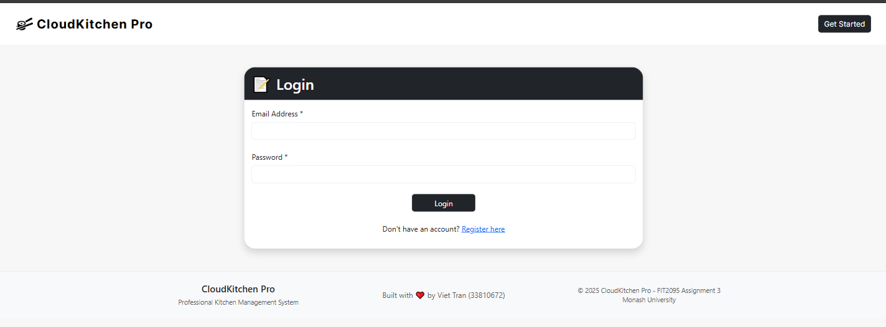
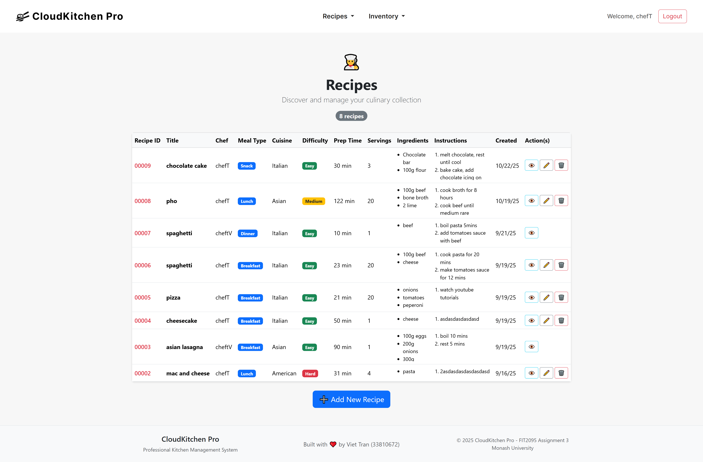
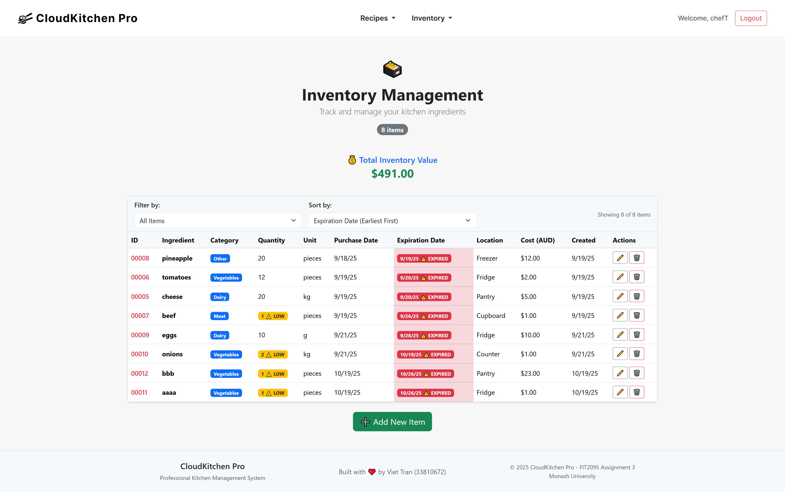
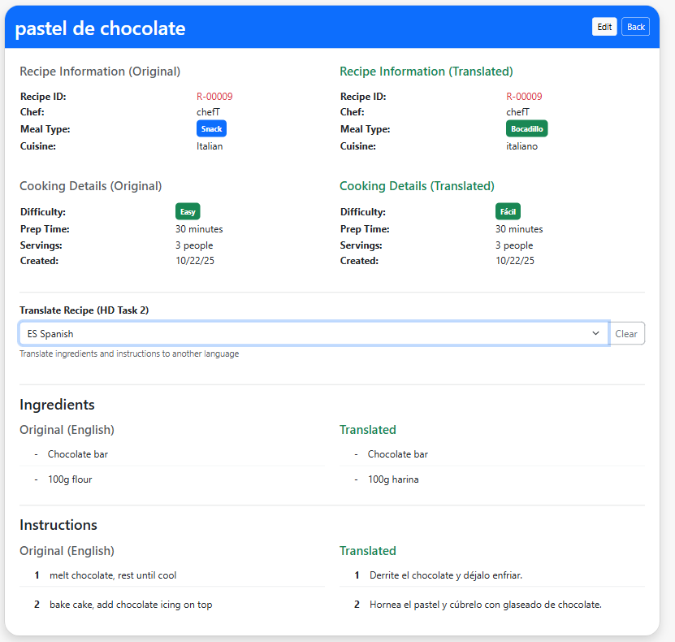
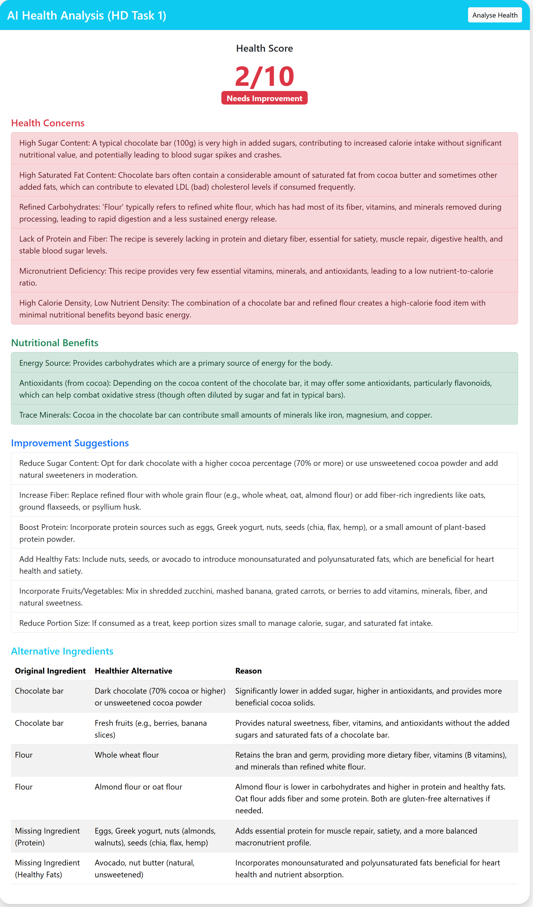

# CloudKitchen-Pro

CloudKitchen-Pro is a comprehensive kitchen management system designed to help chefs and restaurants manage recipes, track inventory, and enhance their culinary experience with AI-powered features. This application provides a full-stack solution with Express.js backend and Angular frontend.

## Tech Stack

- **Backend**: Node.js, Express.js, MongoDB, Mongoose
- **Frontend**: Angular 20, TypeScript, Bootstrap
- **AI Services**: Google Gemini, Google Cloud Translation, Google Cloud Text-to-Speech
- **Real-time**: Socket.io

## Features

### Core Functionality
- **User Management**: Secure authentication and role-based access (Admin, Chef, Manager)

- **Recipe Management**: Create, read, update, and delete recipes with detailed ingredients and instructions
- **Inventory Tracking**: Manage kitchen inventory with categories, quantities, expiration dates, and locations

### AI-Powered Features
- **Recipe Health Analysis**: AI-powered nutritional analysis of recipes using Google Gemini
- **Multi-language Support**: Translate recipes into multiple languages (Spanish, French, Italian, German, Portuguese, Chinese, Japanese, Korean)
- **Text-to-Speech**: Generate audio instructions for recipes using Google Cloud Text-to-Speech

### Technical Features
- Real-time text-to-speech updates with Socket.io
- Responsive web interface with Angular and Bootstrap
- RESTful API architecture for backend
- MongoDB database integration

## Demo/Screenshots

### Screenshots

- **Login Page**
  

- **Dashboard**
  

- **Recipe Management**
  

- **Inventory Management**
  

- **Multi-language Support**
  

- **Text-to-speech**
  

- **AI Health Analysis**
  


## Prerequisites

Before running this application, ensure you have the following installed:
- Node.js (v16 or higher)
- npm or yarn
- MongoDB (local installation or cloud instance)
- Git

## Installation and Setup

### 1. Clone the Repository

```bash
git clone https://github.com/Vincenzoos/CloudKitchen-Pro.git
cd CloudKitchen-Pro
```

### 2. Backend Setup

Navigate to the backend directory and install dependencies:

```bash
cd backend
npm install
```

#### Environment Configuration

Create a `.env` file in the `backend` directory with the following variables:

```env
# Google Gemini API Key for AI recipe analysis
GEMINI_API_KEY=your_gemini_api_key_here

# Google Cloud Credentials (path to service account JSON file)
GOOGLE_APPLICATION_CREDENTIALS=relative_path_to_google-service.json

# MongoDB Connection String
MONGODB_URI=your_connection_string_to_mongodb
```

#### Obtaining API Keys and Credentials

**Google Gemini API Key:**
1. Visit the [Google AI Studio](https://makersuite.google.com/app/apikey)
2. Create a new API key
3. Copy the key to your `.env` file

**Google Cloud Credentials:**
1. Go to the [Google Cloud Console](https://console.cloud.google.com/)
2. Create a new project or select an existing one
3. Enable the following APIs:
   - Cloud Translation API
   - Text-to-Speech API
4. Create a service account:
   - Go to "IAM & Admin" > "Service Accounts"
   - Click "Create Service Account"
   - Give it a name and description
   - Grant the following roles:
     - Cloud Translation API User
     - Cloud Text-to-Speech User
5. Create a key for the service account:
   - Click on the service account
   - Go to the "Keys" tab
   - Click "Add Key" > "Create new key"
   - Choose JSON format
   - Download the file and place it in the `backend` directory as `google-service.json`

**MongoDB Setup:**
- For local development, install MongoDB Community Server
- Start MongoDB service on default port 27017
- Or use a cloud MongoDB service like MongoDB Atlas and update the connection string

### 3. Frontend Setup

Navigate to the frontend directory and install dependencies:

```bash
cd ../frontend
npm install
```

Then generate dist folder to be served by backend
```bash
ng build
```

### 4. Running the Application

Follow these step to start the application in your local environment
## Running the Application

### Start the application

```bash
cd backend
npm run dev
```

The application will start on `http://localhost:8081`


### Access the Application

Open your browser and navigate to `http://localhost:8081` to access the CloudKitchen-Pro application.

## Project Structure

```
CloudKitchen-Pro/
├── backend/                 # Node.js Express server
│   ├── db/                  # Database connection
│   ├── middleware/          # Authentication and validation
│   ├── models/              # Mongoose schemas
│   ├── routes/              # API endpoints
│   ├── utils/               # AI, translation, and TTS services
│   └── app.js               # Main server file
├── frontend/                # Angular application
│   ├── src/
│   │   ├── app/
│   │   │   ├── components/  # UI components
│   │   │   ├── services/    # Angular services
│   │   │   └── guards/      # Route guards
│   └── public/              # Static assets
└── README.md                # This file
```

## Core API Endpoints (non-exhaustive)

### Recipes
- `GET /api/recipes/form-options-{student_id}` - Get recipe form options
- `GET /api/recipes/recipes-{student_id}` - Get all recipes
- `POST /api/recipes/add-{student_id}` - Create new recipe
- `GET /api/recipes/view-{student_id}/:id` - Get recipe by ID
- `PUT /api/recipes/edit-{student_id}/:id` - Update recipe
- `DELETE /api/recipes/delete-{student_id}/:id` - Delete recipe
- `POST /api/recipes/analyze-health-{student_id}` - AI health analysis
- `POST /api/recipes/translate-{student_id}` - Translate recipe
- `POST /api/recipes/text-to-speech-{student_id}` - Generate speech

### Inventory
- `GET /api/inventory/form-options-{student_id}` - Get inventory form options
- `GET /api/inventory/inventories-{student_id}` - Get all inventory items
- `POST /api/inventory/add-{student_id}` - Create inventory item
- `GET /api/inventory/edit-{student_id}/:id` - Get inventory item
- `POST /api/inventory/edit-{student_id}/:id` - Update inventory item
- `POST /api/inventory/delete-{student_id}` - Delete inventory item


## Author

Viet Tran (@Vincenzoos)

